# Conceptual and Logical Data Model

This model implements the domain vocabulary in [`CONTEXT.md`](../CONTEXT.md) and the MVP behavior in [`SPEC.md`](SPEC.md). It is technology-neutral at the conceptual level and relational at the logical level.

## 1. Modeling principles

1. **A barcode is a lookup key, not Product identity.** Product, Package Variant, Package Revision, Observed Package, and Batch use separate immutable internal IDs.
2. **Claims are smaller than records.** Trust, evidence, authority, confidence, and review belong to individual assertions rather than a Product-wide status.
3. **Evidence is never silently replaced.** Conflicting and historical Claims remain queryable.
4. **Original label text survives every transformation.** Transcription, normalized concepts, Khmer names, and Derived Assessments are separate layers.
5. **Assessments are reproducible.** AI model, prompt, schema, vocabulary, rule, and source versions are recorded.
6. **Physical-package data stays physical.** Concrete dates and lot codes belong to Observed Packages or Batches, not Products.
7. **External data remains external in provenance.** Open Food Facts fields and images retain source, retrieval, revision, attribution, and license metadata.
8. **Private Package Capture is not catalog ingestion.** MVP shopper media and output remain in an isolated ephemeral store and expire within 24 hours.

## 2. Core catalog and provenance model

Source: [`diagrams/data-model-core.mmd`](diagrams/data-model-core.mmd)

### Product hierarchy

| Entity | Purpose | Important fields and constraints |
|---|---|---|
| `Product` | Stable consumer-recognizable offering | Immutable `id`; contains no barcode, current ingredients, expiry date, or global verification status |
| `PackageVariant` | Market/quantity/language form of a Product | `product_id`; intended market; original quantity text; normalized quantity/unit; multipack and drained-weight structure |
| `ExternalIdentifier` | GTIN, UPC, or other lookup identifier | `package_variant_id`; scheme; normalized value; check-digit/validation state; evidence; optional effective period; unique by scheme/value only when not disputed |
| `PackageRevision` | Historical label/formulation of a Package Variant | `package_variant_id`; observed period; never overwritten by a later formulation |
| `ObservedPackage` | Evidence from one physical package | optional matched revision; observed time; evidence coverage; optional coarse Market Observation for project-owned catalog work |
| `Batch` | Manufacturer lot grouping | lot code; concrete date Claims; may group several Observed Packages |
| `CatalogCandidate` | Internal moderation proposal | target type; proposed identity; status; created/reviewed by project team only |

### Names, quantities, and categories

Product names are Claims rather than a single mutable column. Each name carries:

- subject (`Product` or `PackageVariant`);
- language tag;
- role (`ORIGINAL_LABEL`, `REVIEWED_KHMER`, `EXTERNAL_COMMUNITY`, `BRAND_MARKETING`);
- source and evidence;
- review state.

`PackageVariant` retains both the original declared quantity and normalized structure:

- numeric value and UCUM-like unit;
- multipack count and inner quantity;
- drained weight where declared;
- source Claim and evidence span.

Shopper categories and Regulatory Food Categories use separate versioned taxonomies and mappings. A regulatory mapping stores its standard, category code, evidence, confidence, and review state.

### Organizations

`Organization` represents a brand owner, manufacturer, importer, distributor, or certifier. `OrganizationRole` links an Organization to the relevant Product, Package Variant, Package Revision, or Batch with:

- role type;
- effective period;
- source Claim and evidence.

Manufacture origin is its own Claim. Brand country and GS1 prefix must never populate it automatically.

## 3. Claim and evidence model

### Claim

A logical `Claim` contains:

| Field | Meaning |
|---|---|
| `id` | Immutable internal identifier |
| `subject_kind` / `subject_id` | Product, Package Variant, Package Revision, Observed Package, Batch, Organization, Certificate, or other supported subject |
| `predicate` | Stable vocabulary such as `product.name`, `package.ingredients_declared`, or `batch.expiry_date` |
| `value_json` | Typed value encoded according to the predicate schema |
| `production_method` | `HUMAN_ENTRY`, `AI_EXTRACTION`, `EXTERNAL_IMPORT`, `RULE_DERIVATION`, or `REGISTRY_LOOKUP` |
| `review_state` | `PROPOSED`, `ACCEPTED`, `DISPUTED`, `REJECTED`, `SUPERSEDED`, or `WITHDRAWN` |
| `confidence` | Method confidence, never a substitute for review or authority |
| `created_at` | Claim creation time |
| `supersedes_claim_id` | Optional historical relationship |

For a relational implementation, use typed subject junction tables or nullable typed foreign keys with a `CHECK` constraint requiring exactly one subject. Do not rely on an unconstrained polymorphic ID.

### Evidence

`Evidence` stores the type, source, language, observation/retrieval time, license, integrity hash, and storage reference. Evidence may be:

- project-owned package media;
- an external record field or snapshot;
- a manufacturer or certifier document;
- a registry lookup response;
- a reviewed transcription span.

`ClaimEvidence` is a many-to-many junction containing:

- `claim_id` and `evidence_id`;
- stance: `SUPPORTS` or `CONTRADICTS`;
- optional page/image region/text span;
- annotation and reviewer.

### Preferred Claims and conflicts

`PreferredClaim` selects one Claim for a predicate within a specific Package Revision and records moderator, reason, and selection time. Enforce uniqueness on `(package_revision_id, predicate)` for an active selection.

A competing credible Claim is not deleted. It may cause:

- both Claims to become `DISPUTED`;
- an `UnresolvedConflict` record with severity and shopper-display policy;
- creation of a new Package Revision when evidence shows a genuine historical or market change.

## 4. Ingredient, vocabulary, and assessment model

Source: [`diagrams/data-model-assessment.mmd`](diagrams/data-model-assessment.mmd)

### Transcription and ingredient tree

`LabelTranscription` stores the complete original text, language, source image region, and evidence coverage (`COMPLETE_READABLE_LABEL`, `PARTIAL`, `UNREADABLE`, or `NOT_ASSESSED`).

`IngredientOccurrence` preserves:

- parent occurrence for compound ingredients;
- ordinal position among siblings;
- original source text and span;
- declared percentage where present;
- punctuation/bracket context.

`IngredientMapping` links an occurrence to one or more `NormalizedIngredient` candidates with state (`APPROVED`, `AMBIGUOUS`, `AI_SUGGESTED`, `REJECTED`) and confidence. Only approved vocabulary matches can automatically drive safety-critical assessments.

### Reviewed Safety Vocabulary

`VocabularyVersion` is immutable after publication. It contains `VocabularyEntry` records for canonical ingredients, allergens, additives, critical phrases, and Khmer explanations.

`VocabularyEntry.review_state` is one of:

- `AI_DRAFT`
- `IN_LANGUAGE_REVIEW`
- `IN_DOMAIN_REVIEW`
- `APPROVED`
- `REJECTED`
- `SUPERSEDED`

`VocabularySynonym` maps reviewed source terms and derivatives in Khmer, English, Vietnamese, Simplified Chinese, and Thai to a canonical entry. Store relationship type such as `EXACT_NAME`, `SPELLING_VARIANT`, `DERIVED_FROM`, `CONTAINS_SOURCE`, or `PRECAUTIONARY_PHRASE`.

`SafetyVocabularyMatch` links an exact original transcription span to the approved synonym that matched it. The Khmer Ingredient Name is presentation only and is not the safety input.

### Rules and assessments

`RuleSetVersion` is immutable after publication and scoped by jurisdiction. `RegulatoryRule` stores:

- rule type;
- source and edition;
- jurisdiction;
- effective dates;
- Regulatory Food Category scope;
- substance/additive scope;
- maximum concentration and unit when applicable;
- review status.

`AssessmentRun` records the exact Claims, Vocabulary Version, Rule Set Version, and processing version used. `DerivedAssessment` stores assessment type, outcome, evidence-coverage state, explanation key, and supersession time.

Required outcome families:

| Assessment | Outcomes |
|---|---|
| Allergen | `DECLARED_CONTAINS`, `DECLARED_MAY_CONTAIN`, `DERIVED_FROM_INGREDIENT`, `NO_DECLARATION_DETECTED_IN_READABLE_LABEL`, `LABEL_INCOMPLETE_OR_UNREADABLE`, `NOT_ASSESSED` |
| Halal ingredient | `EXPLICIT_PROHIBITED_INGREDIENT_DECLARED`, `SOURCE_AMBIGUOUS`, `NO_NON_HALAL_INGREDIENT_DETECTED_IN_READABLE_LABEL`, `LABEL_INCOMPLETE_OR_UNREADABLE`, `NOT_ASSESSED` |
| Additive | `IDENTIFIED`, `RULE_APPLIES`, `CONCENTRATION_UNKNOWN`, `CATEGORY_UNCERTAIN`, `NEUTRAL_EXPLAINER_ONLY`, `NOT_ASSESSED` |
| Date | `DATE_HAS_PASSED`, `DATE_HAS_NOT_PASSED`, `DATE_MEANING_UNCERTAIN`, `NOT_ASSESSED` |

Absence-style outcomes require complete readable evidence. A partial label cannot produce `NO_DECLARATION_DETECTED_IN_READABLE_LABEL`.

### Knowledge entries

`KnowledgeEntry` is reusable and versioned by concept and locale. Store source citations, jurisdiction, author, language reviewer, domain reviewer, review state, and superseded version. Product-specific Claims never live inside general Knowledge Entries.

## 5. Dates, nutrition, seals, and certificates

### Dates

`DateMarking` belongs to an Observed Package and optionally a Batch. It stores original text, detected type, parsed value, locale/format assumptions, and parser version. A Product or Package Revision must not have a concrete expiry-date column.

### Nutrition

`NutritionDeclaration` stores basis (`PER_SERVING`, `PER_100_G`, `PER_100_ML`, `PER_PACKAGE`, `PREPARED`, `UNKNOWN`), serving description, nutrient, value, unit, and evidence span. Values with incompatible bases are not directly comparable.

Nutrition Visualization is deferred, but normalized values may be retained when source basis is explicit.

### Seals and certificates

`SealObservation` records only what was visible on an Observed Package. `Certificate`, `CertificateScope`, and `CertificateVerificationEvent` are separate future-ready structures. A visible logo cannot populate verified certificate status.

## 6. External-source model

`ExternalSource` records source name, type, base URL, license, attribution requirement, and terms version. `ExternalSnapshot` records source record ID, request/source URL, retrieval time, source revision, response hash, and optionally the raw response needed for audit.

For Open Food Facts:

- map each non-empty field to proposed Claims with field-level provenance;
- preserve selected image attribution and source URLs;
- record `last_modified_t` or equivalent source revision data;
- never create negative Claims from missing fields;
- never derive manufacture origin from the GS1 prefix;
- keep OFF-only results distinguishable in queries and UI.

## 7. Ephemeral shopper boundary

The MVP uses a physically or logically separate ephemeral store for `ShopperSession`, `PackageCaptureJob`, temporary `CaptureMedia`, private `ExtractionRun`, and private result data.

Invariants:

- No shopper account or durable cross-session identifier is created.
- `CaptureMedia.expires_at` is at most 24 hours after upload.
- Media is excluded from catalog, training, analytics, and manual-review pipelines.
- Private Claims and assessments cannot be selected as Preferred Claims or attached to durable Package Revisions.
- Session history expires with the session.
- Analytics receive only short-lived session ID, event type, latency, and failure category.

Catalog ingestion uses project-owned or separately licensed evidence through a distinct internal workflow.

## 8. AI provenance

`ExtractionRun` records provider, model, prompt version, schema version, processing time, status, latency, failure reason, raw structured output, and proposed Claims/translations. It links to every input Evidence item.

Model choice is configuration, not a domain status. Benchmark results should be stored in a separate evaluation dataset containing expected transcriptions and assessments, without mixing evaluation media into shopper Package Capture.

## 9. Moderation and audit

Every moderator action records actor, action type, subject, before/after state, reason, evidence/rule references, and timestamp. MVP Moderators may:

- accept, dispute, reject, or supersede Claims;
- create or split Package Revisions;
- select Preferred Claims;
- approve vocabulary and Knowledge Entries only when assigned the required review role.

Moderator acceptance is not authoritative-source confirmation. Store authoritative confirmation as a separate verification event with source evidence.

## 10. Key database invariants

1. A Product has no barcode, expiry date, ingredient list, or verification-status column.
2. Every active Package Revision belongs to exactly one Package Variant.
3. Every concrete Date Marking belongs to an Observed Package and optionally a Batch.
4. Every Derived Assessment belongs to one Assessment Run.
5. Every safety-critical match points to original transcription evidence and an approved vocabulary version.
6. Only one active Preferred Claim exists per Package Revision and predicate.
7. Claims and assessments are superseded, not destructively overwritten.
8. External Claims retain source, retrieval time, and license metadata.
9. A seal observation cannot imply certificate verification.
10. Ephemeral shopper data cannot cross into durable catalog tables.

## 11. Suggested implementation order

1. Product hierarchy, External Identifiers, names, and OFF snapshots
2. Claims, Evidence, ClaimEvidence, and Preferred Claims
3. Label transcription and ingredient tree
4. Versioned vocabulary, synonyms, and Safety Vocabulary Matches
5. Extraction Runs, Assessment Runs, and assessment outcomes
6. Ephemeral Package Capture boundary and deletion enforcement
7. Knowledge Entries and moderation audit
8. Deferred certification, compliance, contribution, and sharing structures only when those features enter scope
