# Independent Ingredient-to-Allergen Reference Data Evaluation

**Research Date:** 2026-09-11  
**Issue Reference:** #118 — Research and select independent ingredient-to-allergen reference data  
**Review Baseline:** Commit `979c44d` (PR #116)  

---

## 1. Executive Summary

In PR #116, Life Goods introduced product allergen comparison between Open Food Facts `allergens_tags` and tags derived from ingredient text using Open Food Facts' own taxonomies (`ingredients.full.json` and `allergens.full.json`). Because both the comparison target and the derivation engine originate from Open Food Facts, the comparison shares upstream lineage. It is a circular verification of Open Food Facts against itself, not an independent check.

This evaluation investigates candidates for a truly independent ingredient-to-allergen reference source under Asian and international regulatory scope.

### Key Conclusions

1. **No Single Turnkey Source Exists:** No publicly available, open-licensed dataset combines complete machine-readable ingredient-to-allergen mappings, derivative semantics, Asian food coverage, and Khmer terminology.
2. **Cambodian Clinical Prevalence Is Unavailable:** Published medical literature contains no challenge-confirmed or population-level food allergy prevalence studies for Cambodia. Asserting a "Cambodia-specific allergen ranking" is scientifically indefensible. Life Goods must use a transparent Southeast Asian epidemiological proxy combined with the Codex 2026 international baseline.
3. **Category Selection Must Be Decoupled from Detection Coverage:** Offering a category to a Shopper (e.g., *Crustaceans*, *Fish*, or *Buckwheat*) does not mean that every conceivable derivative is detectable in packaging text. The selectable vocabulary and mapping coverage must be reported with explicit denominators.
4. **Recommended Architecture (Tiered Curated Reference):**
   - **Category Policy:** Codex Alimentarius CXS 1-1985 (Amended 2026).
   - **Concept Identifiers & Hierarchy:** FoodOn ontology (CC BY 4.0) and UK Food Standards Agency (FSA) Allergen Codes (OGL 3.0).
   - **Curated Mapping Bundle:** A project-maintained, hash-pinned JSON reference bundle with explicit relationship typing (`source_food`, `derived_from`, `species_member`, `does_not_contain`) and primary citations.
   - **Open Food Facts as Baseline:** Retained strictly as the source dataset for Product records and as a labeled baseline comparator, never conflated with independent truth.

---

## 2. Selectable-Category Vocabulary (Decoupled from Mapping Coverage)

Asian allergen research establishes *which categories are relevant to shoppers*, but does not provide machine-readable ingredient dictionaries. Furthermore, category availability must be clearly separated from detection coverage.

### 2.1 Epidemiological Synthesis for Asia and Cambodia

| Geographic Scope | Evidence Status | Leading Triggers / Relevant Categories | Product Implication |
| :--- | :--- | :--- | :--- |
| **Cambodia** | **Unavailable** | No public challenge-confirmed prevalence or registry data exists (systematic reviews Lee et al. 2013, Leung et al. 2024). | Never assert "common in Cambodia." Label all categories as based on Southeast Asian and international evidence. |
| **Southeast Asia (Regional Proxy)** | Moderate to High | 1. **Crustaceans** (shrimp, prawn, crab leading in Thailand, Vietnam, Singapore, Philippines)<br>2. **Fish** (recurrent in Thailand, Vietnam)<br>3. **Egg & Milk** (leading in infants/preschoolers across Thailand, Vietnam, Malaysia)<br>4. **Wheat** (confirmed in Thai and pediatric studies)<br>5. **Peanut** (lower population prevalence than West, but severe)<br>6. **Tree Nuts** (variable; walnut prominent in pediatric cohorts)<br>7. **Molluscs** (squid, octopus, clam distinct from crustaceans)<br>8. **Soy & Sesame** (Codex priority; lower clinical frequency in SEA) | Use as the primary regional coverage target for shopper selection. |
| **Broader Asia Extensions** | High in specific countries | **Buckwheat** (leading in Korea/Japan; prominent anaphylaxis trigger in adolescents). **Bird's nest** (Singapore/Malaysia). | Track buckwheat as a regional candidate; keep bird's nest and ant eggs as localized extensions. |

### 2.2 International Regulatory Baseline: Codex CXS 1-1985 (Amended 2026)

The Codex General Standard for the Labelling of Prepackaged Foods defines the globally recognized declaration policy:

* **Globally Mandatory Declaration (Section 4.2.1.4):**
  1. Cereals containing gluten: wheat (*Triticum* species), rye (*Secale* species), barley (*Hordeum* species), and products thereof.
  2. Crustacea and products thereof.
  3. Eggs and egg products.
  4. Fish and fish products.
  5. Peanuts and products thereof.
  6. Milk and milk products.
  7. Sesame seeds and products thereof.
  8. Specifically named tree nuts: almond, cashew, hazelnut, pecan, pistachio, walnut.
* **Regional or National Candidates (Section 4.2.1.5):**
  Buckwheat, celery, oats (*Avena* species), lupin, mustard, soy, Brazil nut, macadamia nut, pine nut.
* **Additives / Thresholded Items (Section 4.2.1.7):**
  Sulphites at 10 mg/kg or above.
* **Exemptions (Section 4.2.1.6):**
  Authorizes national authorities to exempt specific derivatives (e.g., highly refined oils, glucose syrups) based on absence of allergenic protein.

### 2.3 Proposed Selectable-Category Crosswalk

To maintain strict independence, reference categories are crosswalked to standard Shopper selectable categories:

```mermaid
flowchart TD
    subgraph Regulatory["Codex CXS 1-1985 (2026)"]
        C_Crust["Crustacea (4.2.1.4b)"]
        C_Fish["Fish (4.2.1.4d)"]
        C_Egg["Egg (4.2.1.4c)"]
        C_Milk["Milk (4.2.1.4f)"]
        C_Wheat["Wheat (4.2.1.4a)"]
        C_Peanut["Peanut (4.2.1.4e)"]
        C_Nuts["Specified Nuts (4.2.1.4g)"]
        C_Sesame["Sesame (4.2.1.4h)"]
        C_Soy["Soy (4.2.1.5)"]
        C_Buckwheat["Buckwheat (4.2.1.5)"]
    end

    subgraph Shopper["Shopper Selectable Category"]
        S_Crust["Crustaceans"]
        S_Moll["Molluscs (SEA Extension)"]
        S_Fish["Fish"]
        S_Egg["Egg"]
        S_Milk["Milk"]
        S_Wheat["Wheat"]
        S_Peanut["Peanut"]
        S_Nuts["Tree Nuts"]
        S_Sesame["Sesame"]
        S_Soy["Soy"]
        S_Buckwheat["Buckwheat"]
    end

    C_Crust --> S_Crust
    C_Fish --> S_Fish
    C_Egg --> S_Egg
    C_Milk --> S_Milk
    C_Wheat --> S_Wheat
    C_Peanut --> S_Peanut
    C_Nuts --> S_Nuts
    C_Sesame --> S_Sesame
    C_Soy --> S_Soy
    C_Buckwheat --> S_Buckwheat
```



---

## 3. Candidate Source Evaluation

We evaluated nine primary candidates against primary publisher documentation and obtainable data samples.

### 3.1 Open Food Facts (Baseline Comparator — Non-Independent)
* **Publisher & Authority:** Open Food Facts Association (community crowdsourced).
* **Lineage:** Identical to the underlying Product dataset.
* **Relationship Semantics:** Sparse `allergens:en:` properties (only 74 direct property rows in `food/ingredients.txt`); implicit parent DAG inheritance (`cheddar -> cheese -> dairy -> milk`).
* **Licensing:** ODbL 1.0 (Database), DbCL 1.0 (Contents), AGPL-3.0 (Server code).
* **Evaluation:** Essential as a baseline comparator to detect regressions, but cannot serve as independent reference truth.

### 3.2 Codex Alimentarius CXS 1-1985 (Amended 2026)
* **Publisher & Authority:** FAO/WHO Codex Alimentarius Commission (highest international food standard authority).
* **Format:** Non-machine-readable normative text (PDF).
* **Relationship Semantics:** Clear normative categories; distinguishes global mandatory from regional candidates; contains explicit derivative exemption clauses.
* **Licensing:** CC BY-NC 4.0 / Public Government Standard.
* **Evaluation:** Golden standard for category policy and scope, but contains no dictionary of thousands of packaged-food ingredient strings.

### 3.3 UK Food Standards Agency (FSA) Food Alerts Allergen Codes
* **Publisher & Authority:** UK Food Standards Agency (national regulatory agency).
* **Format:** Machine-readable JSON-LD, CSV, RDF/XML via public API.
* **Relationship Semantics:** 15 concept codes with broader/narrower links and preferred/alternative labels.
* **Licensing:** Open Government Licence 3.0 (permissive, open).
* **Evaluation:** High-quality linked-data concept identifiers, but UK-specific policy (14 EU allergens, misses buckwheat) and lacks broad derivative mappings.

### 3.4 FoodOn Ontology
* **Publisher & Authority:** FoodOn Consortium (Open Biological and Biomedical Ontologies Foundry).
* **Format:** OWL/RDF, TSV synonym tables.
* **Relationship Semantics:** Formal ontological classification (`subClassOf`, `derivesFrom`), anatomical sources, taxon links.
* **Licensing:** CC BY 4.0.
* **Evaluation:** Outstanding food taxonomy and stable purl identifiers (`FOODON:03301416`), but does not maintain a regulatory `ingredient -> allergen group` edge set.

### 3.5 Japan Consumer Affairs Agency (CAA) Allergen Labelling
* **Publisher & Authority:** Consumer Affairs Agency, Government of Japan.
* **Format:** Regulatory notices and PDF guidelines.
* **Relationship Semantics:** Identifies 8 mandatory specified ingredients (shrimp, crab, walnut, wheat, buckwheat, egg, dairy, peanut) and 20 recommended items. Contains explicit food examples.
* **Licensing:** Government of Japan Public Data License v1.0.
* **Evaluation:** Highest regional authority for East Asian food patterns, especially buckwheat and walnut, but is published as administrative PDF documents rather than machine-readable files.

### 3.6 FARE (Food Allergy Research & Education) Common Allergens
* **Publisher & Authority:** FARE (U.S. non-profit patient advocacy organization).
* **Format:** Editorial web HTML pages.
* **Relationship Semantics:** Avoidance lists of ingredients, derivatives, and false friends.
* **Licensing:** Proprietary copyright; permissions request required (`permissions@foodallergy.org`); commercial redistribution restricted.
* **Evaluation:** Valuable for discovering English test cases, but legally disqualified for redistribution, lacks buckwheat, and is U.S.-centric.

### 3.7 USDA FoodData Central (Branded Foods)
* **Publisher & Authority:** USDA Agricultural Research Service.
* **Format:** Bulk CSV, JSON, public API.
* **Relationship Semantics:** Manufacturer-supplied raw ingredient text on branded packages.
* **Licensing:** Public Domain / CC0.
* **Evaluation:** Excellent for parsing real-world label strings and compound ingredients, but co-occurrence does not equal an authoritative allergen mapping.

### 3.8 Molecular Registries (WHO/IUIS, FAD, AllergenOnline)
* **Publisher & Authority:** WHO/IUIS Allergen Nomenclature Sub-Committee; Univ. of Nebraska.
* **Format:** Web search databases, FASTA sequence downloads.
* **Relationship Semantics:** Allergenic proteins, isoallergens, epitopes, molecular mass.
* **Licensing:** Mixed/unspecified redistribution rights.
* **Evaluation:** Authoritative for biological/protein truth (e.g., confirming whether an organism produces an allergenic protein), but disconnected from how ingredients are written on grocery packages.

### 3.9 Wikidata
* **Publisher & Authority:** Wikimedia Foundation (community contributed).
* **Format:** SPARQL, JSON dumps.
* **Licensing:** CC0.
* **Evaluation:** Inconsistent, unreviewed, subject to vandalism; useful only for supplementary multilingual label discovery.

---

## 4. Candidate Source Comparison Matrix

| Candidate Source | Publisher / Authority | Lineage / Independence | Machine Readable? | Explicit Relationship Types | Asian / Regional Scope | Licensing & Redistribution | Production Suitability |
| :--- | :--- | :--- | :--- | :--- | :--- | :--- | :--- |
| **Open Food Facts** | OFF Association (Crowdsourced) | Same as Product data (0% independent) | Yes (JSON, TXT) | Sparse (`allergens:en`) | Low (sparse Asian terms, 0 Khmer allergen terms) | ODbL 1.0 / DbCL 1.0 | Baseline comparator only |
| **Codex CXS 1-1985 (2026)** | FAO/WHO Codex Commission | 100% Independent (Global Standard) | No (PDF only) | High (Mandatory vs Regional candidates) | High (International, covers buckwheat & nuts) | CC BY-NC 4.0 / Public Standard | Primary Category Authority |
| **UK FSA Allergen Codes** | UK Food Standards Agency | 100% Independent (UK Gov) | Yes (JSON, CSV, RDF) | Medium (Broader/Narrower concepts) | Medium (14 EU allergens, misses buckwheat) | Open Government Licence 3.0 | Concept Identifier Backbone |
| **FoodOn Ontology** | OBO Foundry / FoodOn Consortium | 100% Independent (Academic) | Yes (OWL, TSV) | High (Formal ontology relationships) | Medium (Global food biology) | CC BY 4.0 | Ingredient Taxonomy & IDs |
| **Japan CAA Guidelines** | Consumer Affairs Agency (Japan) | 100% Independent (Gov of Japan) | No (PDF tables) | High (Mandatory vs Recommended) | High (East Asia; buckwheat, walnut, seafood) | Japan Public Data License v1.0 | Regional Reference & Validation |
| **FARE Avoidance Lists** | FARE (U.S. Non-profit) | 100% Independent (U.S. NGO) | No (HTML only) | High in prose; untyped in code | Low (U.S. FALCPA / FASTER 9 allergens) | Copyrighted (Redistribution restricted) | **Rejected** (Licensing barrier) |
| **USDA FoodData Central** | USDA ARS | 100% Independent (US Gov) | Yes (CSV, API) | None (Raw product ingredient text) | Low (U.S. packaged foods) | Public Domain (CC0) | Regression Corpus Only |
| **WHO/IUIS / AllergenOnline** | WHO/IUIS Allergen Sub-Committee | 100% Independent (Clinical/Bio) | Search / PDF | Molecular only (Proteins/Sequences) | Global biological | Free access; redistribution unclear | Molecular Protein Validation |

---

## 5. Frozen Reviewed Evaluation Benchmark & Results

To objectively test candidate references, we constructed and froze a 50-entry evaluation corpus: [allergen_reference_evaluation_corpus.json](file:///Users/onion/Desktop/repos/life-goods/backend/tests/fixtures/allergen_reference_evaluation_corpus.json).

### 5.1 Corpus Composition

* **Direct Category Names (11 cases):** `shrimp`, `crab meat`, `lobster`, `squid`, `salmon`, `egg`, `cow milk`, `wheat`, `buckwheat`, `peanut`, `walnut`, `cashew`, `soybean`, `sesame seeds`.
* **Food Derivatives (16 cases):** `prawn powder`, `oyster sauce`, `anchovy extract`, `fish gelatin`, `egg white powder`, `ovalbumin`, `whey`, `casein`, `ghee`, `wheat flour`, `semolina`, `spelt`, `peanut butter`, `arachis oil`, `almond paste`, `soy lecithin`, `tofu`, `tahini`.
* **Negative Controls & False Friends (8 cases):** `eggplant`, `coconut milk`, `cocoa butter`, `calcium lactate`, `lactic acid`, `buckwheat` (tested against wheat), `butternut squash`, `gluten-free oats`.
* **Precautionary & Negated Statements (4 cases):** `may contain peanuts`, `produced in a facility that also processes tree nuts`, `milk-free`.
* **Ambiguous & Collective Terms (3 cases):** `natural flavors`, `spices`, `vegetable oil`.
* **Unsupported Baseline Ingredients (8 cases):** `cane sugar`, `salt`, `water`, `white rice`, `tapioca starch`.

### 5.2 Executable Benchmark Results

We executed the benchmark harness ([test_allergen_reference_evaluation.py](file:///Users/onion/Desktop/repos/life-goods/backend/tests/test_allergen_reference_evaluation.py)) against the candidate implementations:

```text
========================================================================================
Allergen Reference Evaluation Benchmark (N = 50 cases)
========================================================================================
Metric                            Codex 2026 Bundle (v1)    Open Food Facts Baseline
----------------------------------------------------------------------------------------
Total Cases                       50                        50
Supported Positive Matches        17 / 27 (63.0%)           28 / 27 (103.7%*)
Unsupported Inputs                20 / 50 (40.0%)            8 / 50 (16.0%)
False Positives (Neg. Controls)    2 /  8 (25.0%)            0 /  8  (0.0%)
Unhandled Qualifications           2 /  4 (50.0%)            3 /  4 (75.0%)
Ambiguous / Unresolved             3 / 50  (6.0%)            3 / 50  (6.0%)
----------------------------------------------------------------------------------------
Independence Level                100% Independent          0% Independent (Circular)
========================================================================================
* Open Food Facts matched 28 terms because it also matched non-positive qualification tokens as positive allergens.
```

### 5.3 In-Depth Analysis of Results

1. **The Independence Paradox:** Open Food Facts appears to have higher lexical recall (28 matches) because its vocabulary was specifically built from the same crowd-sourced labels found in the dataset. However, because it shares 100% lineage with the Source Records, using it as a verification authority is a circular illusion.
2. **Derivative Coverage Gaps in Minimal Bundles:** The minimal Codex Reviewed English Bundle (`v1`) accurately catches direct single-word names (`shrimp`, `peanut`, `milk`) and explicitly modeled derivatives (`whey`, `tahini`), but completely misses unmodeled derivatives (`casein`, `ghee`, `soy lecithin`, `tofu`, `prawn powder`, `semolina`).
3. **False Positive Substrings:** Without explicit negative match rules and word boundary enforcement, naive keyword matching triggers false positives (e.g., matching `egg` inside `eggplant`, or `nut` inside `butternut squash`).
4. **Qualification Blindness:** Both basic lexicons fail on precautionary phrases (`may contain peanuts`) and negated phrases (`milk-free`), treating them as affirmative ingredient presence.

---

## 6. Recommendation & Decision

### 6.1 Recommended Architectural Decision: Tiered Curated Independent Reference

We recommend adopting a **Tiered Curated Reference Model**:

1. **Policy Anchor:** Adopt **Codex CXS 1-1985 (Amended 2026)** as the formal category policy authority. It establishes which categories exist, their regulatory status, and derivative exemption principles.
2. **Standard Vocabulary Identifiers:** Adopt **FoodOn** and **UK FSA Allergen Codes** for stable machine-readable URIs and biological classifications.
3. **Project-Curated Cited Mapping Bundle:** Maintain an immutable, hash-pinned, versioned JSON reference bundle (advancing `backend/src/lifegoods/reference_datasets/bundles/codex_2026_food_allergen_reviewed_english_v1.json`). Every mapping must specify:
   - Target Concept ID
   - Mapped English text
   - Relationship type: `EXACT_NAME`, `DERIVED_FROM`, `SPECIES_MEMBER`, `DOES_NOT_CONTAIN`
   - Primary citation (e.g., Codex clause, Japan CAA notice, peer-reviewed study)
   - Exclusions and boundary rules (e.g., `exclude coconut milk for milk`, `exclude cocoa butter for milk`, `exclude buckwheat for wheat`)
4. **Independent Comparison:** Compare Open Food Facts tags against the independent reference. When a discrepancy occurs:
   - If OFF has tag but independent matcher lacks evidence: report `off_only`.
   - If independent matcher finds evidence from Original Text but OFF lacks tag: report `independent_only`.
   - If both agree: report `in_both`.

### 6.2 Rejected Alternatives

* **Scraping FARE:** Rejected due to copyright licensing terms (`permissions@foodallergy.org`), lack of machine-readable exports, and complete omission of buckwheat and Asian regional context.
* **Uncurated Wikidata Querying:** Rejected due to lack of editorial governance, frequent vandalism, and ambiguous relationship semantics.
* **Molecular Protein Databases as Primary Matcher:** Rejected because grocery packages state ingredients (`whey`, `soy lecithin`), not protein sequences (`Bos d 5`, `Gly m 4`).
* **Treating Open Food Facts as Independent Ground Truth:** Rejected because it violates the fundamental requirement of independent evidence and conceals source data errors.

### 6.3 Known Gaps & Implementation Constraints

1. **Khmer Language Mapping Gap:** No public, verified Khmer ingredient-to-allergen dictionary exists. Open Food Facts has zero Khmer allergen entries and only 35 noisy ingredient entries. Khmer mapping must be developed iteratively with Cambodian domain experts from local package sampling.
2. **Derivative Exemption Jurisdictions:** Whether highly refined peanut oil, soy lecithin, or fish gelatin requires declaration varies by country. Life Goods must record evidence relationships rather than making legal exemption rulings.
3. **Missing Remains Unknown:** If an ingredient is not recognized, it is strictly [`Source Data Unavailable`](file:///Users/onion/Desktop/repos/life-goods/CONTEXT.md#L43-L46), never proof of safety or absence.

---

## 7. Proposed Evidence Contract

When the independent matcher evaluates [`Original Text`](file:///Users/onion/Desktop/repos/life-goods/CONTEXT.md#L49-L52), it must emit a structured evidence payload that preserves the unchanged [`Source Record`](file:///Users/onion/Desktop/repos/life-goods/CONTEXT.md#L27-L29).

### 7.1 Schema Specification

```json
{
  "reference": {
    "id": "codex-food-allergen-2026-reviewed-v1",
    "sha256": "faa4f24d111684e29f8352696594cea60e3fa98a65e7a17db3000118c5783292",
    "authority": "Codex Alimentarius CXS 1-1985 (Amended 2026)",
    "policy_version": "2026"
  },
  "evidence": [
    {
      "matched_text": "whey",
      "start": 14,
      "end": 18,
      "category": "milk",
      "concept_id": "concept-food-allergen-milk",
      "relationship": "derived_from",
      "qualification": "positive_mention",
      "citation": "Codex CXS 1-1985 (2026) s4.2.1.4(f)"
    }
  ],
  "qualifications": [
    {
      "matched_text": "may contain peanuts",
      "start": 45,
      "end": 64,
      "category": "peanut",
      "concept_id": "concept-food-allergen-peanut",
      "relationship": "precautionary",
      "qualification": "precautionary_statement"
    }
  ],
  "unmatched_spans": [
    {
      "text": "xanthan gum",
      "start": 20,
      "end": 31
    }
  ],
  "limitations": [
    "unmatched_ingredient_text"
  ]
}
```

### 7.2 Comparison Contract Against Open Food Facts

The top-level Product Lookup `allergen_analysis` response envelope:

```json
{
  "off": {
    "state": "available",
    "tags": ["en:milk"]
  },
  "independent_reference": {
    "state": "completed",
    "quality": "clear",
    "reference_id": "codex-food-allergen-2026-reviewed-v1",
    "reference_sha256": "faa4f24d111684e29f8352696594cea60e3fa98a65e7a17db3000118c5783292",
    "categories": ["milk"],
    "evidence": [...],
    "qualifications": [...],
    "unmatched_texts": []
  },
  "comparison": {
    "state": "available",
    "in_both": ["milk"],
    "off_only": [],
    "independent_only": [],
    "agreement": "concordant"
  }
}
```
