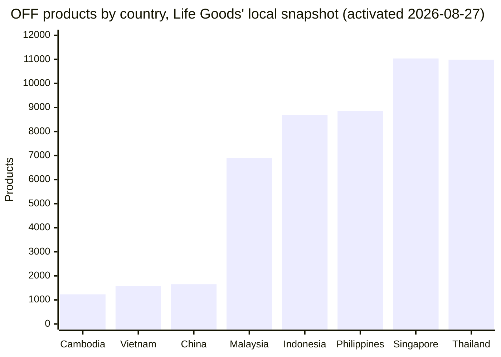
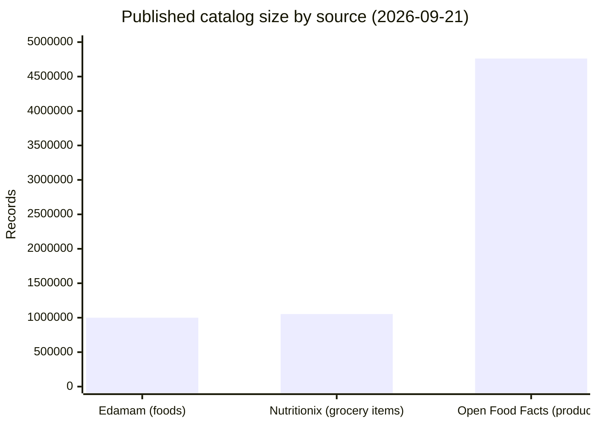

# Open Food Facts as Life Goods' source dataset: evidence review

Research date: 2026-09-21

## Conclusion

Open Food Facts (OFF) is the only realistic source dataset for Life Goods among the alternatives examined, but the case for it is a case about legal and architectural fit, not about superior Cambodia data. No source examined — OFF included — has strong barcode coverage for products sold in Cambodia. Querying Life Goods' own activated local snapshot directly (the actual dataset the app serves — see criterion 2) found **1,232 products** tagged `countries_tags: "en:cambodia"` out of 4,710,709 total, against 958,705 for the United States and 1,261,102 for France. OFF's live public search API independently reported a close, slightly higher figure for the same query on 2026-09-21 (**1,274** products, consistent with three-and-a-half weeks of database growth since the snapshot was taken — [OFF API v2 search](https://world.openfoodfacts.org/api/v2/search), [OFF homepage](https://world.openfoodfacts.org/)), while OFF's newer search-a-licious backend reported a much lower, and on cross-checking, apparently unreliable, 409. Cambodia coverage is therefore on the order of 0.03% of the database — thin by any measure, and now backed by a direct count of the data Life Goods actually ships rather than a live estimate alone.

What tips the decision toward OFF is that it is the only candidate that simultaneously:

1. grants an explicit, no-permission-needed right to redistribute and self-host the full database under [ODbL 1.0](https://opendatacommons.org/licenses/odbl/1.0/) plus [DbCL 1.0](https://opendatacommons.org/licenses/dbcl/1.0/) for individual records, subject only to attribution and share-alike ([OFF terms of use](https://world.openfoodfacts.org/terms-of-use));
2. publishes complete, no-key, no-quota bulk exports (MongoDB dumps, JSONL, Parquet, CSV) on a nightly cadence, which is the exact mechanism this project's `pnpm off:dataset` / `import-file --lookup-only` pipeline depends on ([OFF data & exports page](https://world.openfoodfacts.org/data));
3. costs nothing to use at any volume, being a donation-funded nonprofit rather than a metered commercial API ([OFF fundraising / who we are](https://world.openfoodfacts.org/who-we-are));
4. is structurally open to anyone adding Cambodian products going forward, with a demonstrated pattern of a national coverage base growing from near-zero through volunteer contribution (documented for India, not Cambodia — see below); and
5. has at least some Khmer-language taxonomy data already, which none of the commercial or US-government alternatives have at all.

Every commercial alternative checked (Edamam, Nutritionix) either contractually forbids the bulk self-hosting this project's architecture requires, or only permits it for a recurring fee with no better Cambodia/SEA data underneath it. USDA FoodData Central is public domain and freely bulk-downloadable, but it is a US (and some New Zealand) branded-food and nutrient-composition database by design and was not built to have Cambodia coverage at all. GS1 GDSN is a paid, closed, B2B trading-partner network with no public bulk access. No ASEAN- or Cambodia-specific open barcode/nutrition dataset was found to exist.

**Honest bottom line:** OFF is not chosen because it solves Cambodia coverage — it does not, today. It is chosen because it is the only dataset whose license and export model make a locally hosted, attributed, static snapshot legally and technically possible, and because it is the only one of the group with a plausible, evidenced path (volunteer contribution, OFF's own or partner-run local campaigns) to that coverage improving over time. Life Goods' product boundary — presenting Source Data Unavailable honestly rather than fabricating coverage — is a reasonable response to this weakness, not a workaround for it.

## Comparison at a glance

Same sources as the detailed table below, condensed to fit for *this project's* architecture — a locally hosted, attributed, offline-capable, Khmer-relevant barcode dataset — not a general quality ranking. ✅ fits as-is, ⚠️ workable with a real cost or limitation, ❌ blocks or defeats the purpose.

| Source | License & self-hosting | Bulk export | Cost | Cambodia / SEA data | Khmer / SEA language | Update cadence |
| --- | --- | --- | --- | --- | --- | --- |
| **Open Food Facts** | ✅ ODbL + DbCL, redistribution explicit | ✅ Free, nightly | ✅ Free | ⚠️ 1,232 products in the local snapshot (thin, nonzero) | ⚠️ Sparse, unreviewed Khmer labels | ✅ Continuous + nightly dumps |
| USDA FoodData Central | ✅ Public domain | ✅ Free | ✅ Free | ❌ Not designed for it (US/NZ scope) | ❌ English only | ⚠️ Periodic, dated releases |
| Edamam Food DB API | ❌ Redistribution forbidden by ToS | ❌ None | ⚠️ $14–$299+/mo | ❌ Not published (US/UK-oriented) | ❌ None advertised | ⚠️ Live API only |
| Nutritionix API | ⚠️ Paid license, contract-based | ⚠️ Paid, semi-monthly | ⚠️ Not published | ❌ Not published (~92% US/Canada) | ❌ 13 languages, none SEA | ⚠️ Semi-monthly |
| GS1 GDSN | ❌ No public access (B2B only) | ❌ None public | ⚠️ Not published | ❌ Verification only, no dataset | ❌ Brand-dependent | ⚠️ Real-time, B2B only |

## Source comparison

| Source | License / redistribution terms | Bulk export availability | Cost | Cambodia/SEA barcode coverage | Multilingual support | Update cadence | Recommended use |
| --- | --- | --- | --- | --- | --- | --- | --- |
| [Open Food Facts](https://world.openfoodfacts.org/terms-of-use) | Database: [ODbL 1.0](https://opendatacommons.org/licenses/odbl/1.0/); individual records: [DbCL 1.0](https://opendatacommons.org/licenses/dbcl/1.0/); images: CC BY-SA. Redistribution and self-hosting explicitly permitted, including commercial use, with attribution and share-alike required ([terms of use](https://world.openfoodfacts.org/terms-of-use)) | Yes — nightly MongoDB dumps, JSONL, Parquet, CSV, plus 14-day rolling delta files, no API key or quota required ([data & exports](https://world.openfoodfacts.org/data), [openfoodfacts-exports](https://github.com/openfoodfacts/openfoodfacts-exports)) | Free; nonprofit, donation- and grant-funded ([who we are / fundraising](https://world.openfoodfacts.org/who-we-are)) | Weak in absolute terms but nonzero and open to growth: 1,274 products for Cambodia vs. 11,101 for Thailand, 1,612 for Vietnam, 11,509 for Singapore (all retrieved 2026-09-21 via [OFF API v2 search](https://world.openfoodfacts.org/api/v2/search)) | Taxonomies are multilingual; some Khmer (`km:`) labels exist in the ingredient taxonomy, none found in the allergen taxonomy as of this and prior research ([ingredient taxonomy](https://raw.githubusercontent.com/openfoodfacts/openfoodfacts-server/main/taxonomies/food/ingredients.txt), [allergen taxonomy](https://raw.githubusercontent.com/openfoodfacts/openfoodfacts-server/main/taxonomies/allergens.txt)) | Source database updated continuously by contributors via app/API; full dumps regenerated nightly ([data & exports](https://world.openfoodfacts.org/data)). Life Goods deliberately serves a **static** snapshot, not this live feed — see freshness section below | Only viable option for a locally hosted, attributed, offline-capable barcode dataset |
| [USDA FoodData Central](https://fdc.nal.usda.gov/) | Public domain / [CC0 1.0](https://fdc.nal.usda.gov/api-guide.html) — no restriction on reuse, attribution only requested, not required | Yes — Foundation Foods, SR Legacy, FNDDS, Branded Foods, and a combined "Full Download" as JSON/CSV ([download-datasets](https://fdc.nal.usda.gov/download-datasets/)) | Free; taxpayer-funded US federal program | Effectively none for Cambodia by design — Branded Foods is a US (and some New Zealand) retail-label database; the download page does not claim SE Asia coverage ([download-datasets](https://fdc.nal.usda.gov/download-datasets/)) | English-only branded/nutrient data; no evidence of Khmer or other SEA-language fields in the API guide or download documentation | Branded Foods dataset dated April 2026 at time of research; updated periodically, not continuously | Not a barcode-coverage competitor for Cambodia; could only ever serve as a supplementary nutrient-composition reference, not a product lookup source |
| [Edamam Food Database API](https://developer.edamam.com/food-database-api) | Commercial API terms. Explicitly prohibit building a local copy: "Scrape, build databases, or otherwise create permanent copies of such content, or keep cached copies longer than permitted by the cache header" and "You are prohibited from copying or archiving any of Edamam Content and/or collecting any data ... without Edamam's prior written consent" ([API Terms of Use](https://www.edamam.com/terms/api/)). Only FoodId/Food Label (and on paid tiers, four macros) may be cached, and only for presentation to the querying end user, never to build a competing database ([pricing/comparison table](https://developer.edamam.com/food-database-api)) | Not available — no bulk export product exists; caching is capped and per-request, not a snapshot mechanism | Paid tiers only: $14/mo (100,000 calls), $69/mo (750,000 calls), $299/mo (5,000,000 calls), custom "Unlimited" tier; free tier is non-commercial use only ([pricing](https://developer.edamam.com/food-database-api), [API Terms](https://www.edamam.com/terms/api/)) | ~790,000 UPCs/barcodes and ~1,000,000 foods total in the underlying database as of 2026, with no stated SEA or Cambodia coverage figures published ([pricing/comparison table](https://developer.edamam.com/food-database-api)) | No Khmer or SEA-language support advertised; product is UPC/NLP-driven and appears US/UK-branded-goods oriented | Live API only; ToS forbids the offline self-hosted architecture Life Goods uses regardless of freshness | Legally and architecturally incompatible with this project's static, self-hosted snapshot model |
| [Nutritionix API / Bulk Database Licensing](https://www.nutritionix.com/) (Syndigo) | Commercial, contract-based. Unlike Edamam, Nutritionix explicitly sells a bulk export product ("Database Licensing") separate from the live API, but pricing and terms are negotiated per customer, not published ([nutritionix.com](https://www.nutritionix.com/)) | Yes, but paid and license-gated: "semi-monthly links to the latest version of the Nutritionix database for download, which can be stored locally for unlimited use in your existing databases," as CSV/JSON ([nutritionix.com database page](https://www.nutritionix.com/)) | Not published for the API; historically reported free tier (200 calls/day) plus paid tiers, current site shows only "Contact us" pricing for both API and bulk licensing — treat exact figures as unknown | Explicitly US/Canada-centric: "coverage for over 92% of grocery items in the U.S. and Canada," 1,053,256 grocery items from 48,317 (mostly North American) brands; no Cambodia/SEA coverage claimed ([nutritionix.com](https://www.nutritionix.com/)) | Add-on multilingual nutrition support lists English, Spanish, Portuguese, Dutch, Turkish, German, Italian, French, Japanese, Korean, Czech, Arabic, Polish — no Khmer or other mainland-SEA language ([nutritionix.com](https://www.nutritionix.com/)) | Grocery items updated "on average ... over 3000 grocery items every month"; bulk export refreshed semi-monthly ([nutritionix.com](https://www.nutritionix.com/)) | Bulk licensing is legally closer to feasible than Edamam, but is a paid, negotiated, US/Canada-focused product with no Cambodia data — not worth the cost for this project's coverage needs |
| [GS1 GDSN](https://www.gs1.org/services/gdsn) | Access is only through subscribing to a certified GDSN data pool as a trading partner; this is a B2B synchronization network, not a licensed redistributable dataset ("Any company that needs to send or receive product information can take advantage of GS1 GDSN by subscribing to a data pool" — [GS1 GDSN](https://www.gs1.org/services/gdsn)) | No public bulk export; data flows only between subscribed trading partners' own systems | Paid subscription via a data pool operator; GS1 states pools "collect its annual fees from the Data Pool directly" rather than publishing a public retail price ([GS1 GDSN](https://www.gs1.org/services/gdsn)) | Cambodia has its own GS1 member organization (prefix 884) and a "Verified by GS1" GTIN lookup, but this is a per-barcode brand-owner verification tool, not a bulk consumer nutrition database, and no bulk export or open API is offered ([GS1 Cambodia — Verified by GS1](https://gs1cambodia.org/en/verified-by-gs1)) | Not applicable — GDSN carries whatever a given brand owner submits; no independent Khmer-language layer | Real-time synchronization between trading partners; not a public dataset with a publishable cadence | Not accessible to a consumer app without becoming a paying GDSN trading partner or data-pool subscriber; not evaluated further |
| ASEAN/Cambodia-specific open product or nutrition dataset | None found | N/A | N/A | No dedicated open dataset was located. GS1 Cambodia's registry is a lookup/verification tool, not a bulk nutrition dataset (see above); a general search for an ASEAN open food/nutrition barcode database returned no such project, only OFF and third-party OFF scraper/wrapper services | N/A | N/A | Absence noted as a finding, not assumed — see caveats |

## 1. License terms and redistribution/self-hosting rights

Life Goods locally hosts a static snapshot and must be able to give attribution rather than adopt a live dependency. OFF's own terms of use state the database is available under [ODbL 1.0](https://opendatacommons.org/licenses/odbl/1.0/) and that "individual contents of the database are available under the [Database Contents License](https://opendatacommons.org/licenses/dbcl/1.0/)" ([OFF terms of use](https://world.openfoodfacts.org/terms-of-use)). Reusers "have to mention the licence and to attribute the authorship to Open Food Facts with a link to https://openfoodfacts.org," and the licenses are described as "free licences that authorize the use and reproduction of the content for all purposes, including commercial use," subject to attribution and share-alike for derivative databases (same source). This is precisely the model Life Goods already follows: visible "Data from Open Food Facts" attribution on every product page and a global data-and-licenses notice (per `PRODUCT.md`).

USDA FoodData Central data are US federal government work, "in the public domain and they are not copyrighted," published under CC0 1.0 with attribution only requested, not required ([FDC API guide](http://fdc.nal.usda.gov/api-guide/)). This is even less restrictive than OFF's ODbL/DbCL/share-alike combination, but license permissiveness does not compensate for its lack of Cambodia data (see criterion 2).

Edamam's API Terms of Use are the clearest disqualifier among the commercial options. They state a user "will not ... Scrape, build databases, or otherwise create permanent copies of such content, or keep cached copies longer than permitted by the cache header," and separately "You are prohibited from copying or archiving any of Edamam Content and/or collecting any data from Edamam Content, without Edamam's prior written consent" ([Edamam API Terms of Use](https://www.edamam.com/terms/api/)). Cached fields are capped even on paid tiers to FoodId, Food Label, and (Core tier and above) four macro fields — never a full local mirror ([Edamam Food Database API pricing/comparison](https://developer.edamam.com/food-database-api)). This is a direct, explicit prohibition on the architecture Life Goods uses.

Nutritionix (now operated by Syndigo) is less restrictive on paper: it sells a dedicated "Bulk Database Licensing" product, distinct from its metered API, describing "a monthly export of our entire database in CSV format" that can be "imported into your local database" ([nutritionix.com](https://www.nutritionix.com/)). This is legally closer to what Life Goods needs than Edamam's terms, but it is a paid, contract-based commercial license with pricing available only on request, and (per criterion 2) the underlying database has no meaningful Cambodia coverage regardless of license terms.

GS1 GDSN is not a licensed dataset at all in the OFF/FDC/API sense — it is a B2B data-synchronization network accessed only by subscribing to a certified data pool as a trading partner ("Any company that needs to send or receive product information can take advantage of GS1 GDSN by subscribing to a data pool" — [GS1 GDSN](https://www.gs1.org/services/gdsn)). There is no public bulk-download or redistribution right to evaluate.

## 2. Barcode/GTIN lookup coverage for Cambodia/Southeast Asia

This is OFF's genuine weak point, and it should not be oversold. OFF exposes at least two public search backends that disagree with each other, and this research resolved the disagreement by querying a third, independent source — Life Goods' own local snapshot — directly. All three are disclosed in full below rather than papered over.

Using OFF's legacy v2 API on 2026-09-21 (`https://world.openfoodfacts.org/api/v2/search?countries_tags_en=<country>`):

- Cambodia: **1,274** products
- Vietnam: **1,612** products
- Thailand: **11,101** products
- Singapore: **11,509** products
- United States: **973,247** products
- France: **1,268,548** products
- Global total (homepage counter, same date): **4,761,367** products ([world.openfoodfacts.org](https://world.openfoodfacts.org/))

Malaysia, Indonesia, and the Philippines could not be retrieved from this endpoint during the original research session — it returned repeated HTTP 503 "temporarily unavailable" / anti-bot responses, including a message that read "If you're a bot, all our data can be freely downloaded," suggesting the live web/API frontend rate-limits automated non-browser traffic rather than that the data does not exist.

That block persisted on a later follow-up session, so those three counts — plus China, which had not been checked at all — were instead retrieved from OFF's newer search-a-licious backend (`https://search.openfoodfacts.org/search?q=countries_tags:"en:<country>"`, documented at [search.openfoodfacts.org/docs](https://search.openfoodfacts.org/docs)), on 2026-09-21:

- China: **1,303** products
- Malaysia: **2,955** products
- Indonesia: **4,693** products
- Philippines: **4,349** products

To check whether the two backends were even measuring the same thing, this session re-queried the four countries already retrieved from the v2 API through search-a-licious as well. They disagreed substantially, always in the same direction:

| Country | v2 API (`world.openfoodfacts.org`) | search-a-licious (`search.openfoodfacts.org`) |
| --- | --- | --- |
| Cambodia | 1,274 | 409 |
| Vietnam | 1,612 | 1,017 |
| Thailand | 11,101 | 7,448 |
| Singapore | 11,509 | 6,172 |

Both endpoints are official, publicly documented OFF services, so this research went to a third, independent source to break the tie: **Life Goods' own locally hosted snapshot**, queried directly. This is the actual dataset the app serves — not a live estimate of OFF's upstream state — and it is queryable because Life Goods imports the full OFF export into a local MongoDB collection (`off:dataset -- list` shows the active snapshot: version `9f6d5359fa944e458804c1b63e7365a7`, source `https://static.openfoodfacts.org/data/openfoodfacts-products.jsonl.gz`, retrieved 2026-08-27, 4,710,709 products inserted). A single aggregation over that collection's `countries_tags` field, run 2026-09-21, gave:

| Country | v2 API (2026-09-21) | search-a-licious (2026-09-21) | **Local snapshot (activated 2026-08-27)** |
| --- | --- | --- | --- |
| Cambodia | 1,274 | 409 | **1,232** |
| Vietnam | 1,612 | 1,017 | **1,572** |
| Thailand | 11,101 | 7,448 | **10,984** |
| Singapore | 11,509 | 6,172 | **11,037** |
| China | not retrieved | 1,303 | **1,651** |
| Malaysia | not retrieved | 2,955 | **6,906** |
| Indonesia | not retrieved | 4,693 | **8,686** |
| Philippines | not retrieved | 4,349 | **8,852** |
| France | 1,268,548 | not measured | **1,261,102** |
| United States | 973,247 | not measured | **958,705** |
| Laos | not retrieved | not retrieved | **51** |
| Myanmar | not retrieved | not retrieved | **369** |

This breaks the tie decisively in favor of the v2 API. For every country the local snapshot could check against both live backends, its count sits just below the v2 API's figure — exactly the gap you'd expect from a snapshot retrieved on 2026-08-27 being compared against a live database still growing three-and-a-half weeks later on 2026-09-21. The search-a-licious backend, by contrast, undercounts every single country checked, sometimes severely: it reports well under half of the local snapshot's actual Malaysia count (2,955 vs. 6,906) and less than a third of its Singapore count (6,172 vs. 11,037). The most likely explanation is that search-a-licious's newer index is either still backfilling or excludes a meaningful slice of products the older v2 API and the raw export both include — not that the v2 API or the local snapshot are overcounting.

**Practical conclusion for this project: the local-snapshot column above is the number that matters**, because it is what a Life Goods user actually queries against, not a live estimate of OFF's upstream state. Cambodia sits at 1,232 products in the snapshot Life Goods has actually imported. China's 1,651 is the same order of magnitude as Cambodia's, despite China's population and manufacturing base being vastly larger — underscoring that OFF's coverage gaps track *where volunteer contributors have been active*, not national market size. Malaysia, Indonesia, and the Philippines all sit meaningfully higher (roughly 7,000–8,900), Thailand and Singapore higher still (~11,000), and the US/France two orders of magnitude above all of them. Laos (51) and Myanmar (369) are thinner than Cambodia by a further order of magnitude.

USDA FoodData Central is not a real competitor on this axis: its Branded Foods component is scoped to the US market (and some New Zealand products) by design, not by an accident of contribution volume, and its own download documentation does not describe any Southeast Asian or Chinese coverage ([FDC download-datasets](https://fdc.nal.usda.gov/download-datasets/)). Edamam's published database size (~790,000 UPCs) and Nutritionix's published coverage claim — "coverage for over 92% of grocery items in the U.S. and Canada" — both self-describe as North America/UK-centric aggregations of existing branded-goods catalogs, not global crowdsourced barcode capture, and neither publishes any China-, Cambodia-, or SEA-specific coverage figure ([Edamam pricing](https://developer.edamam.com/food-database-api), [nutritionix.com](https://www.nutritionix.com/)). GS1 Cambodia's own "Verified by GS1" tool is scoped to Cambodian GS1 members' registered GTINs for identity verification, not a browsable nutrition database, and does not publish a product count ([GS1 Cambodia](https://gs1cambodia.org/en/verified-by-gs1)).

The honest reading: nobody has strong Cambodia barcode coverage. OFF's coverage is weak in absolute terms but is the largest and most contributable of the group, and is the only one built by an open, permissionless process that Cambodian contributors (shoppers, local GS1 members, NGOs) can add to directly, the same way OFF's India coverage grew from a handful of contributors to over 10,000 products by 2024 (see criterion 7).

## 3. Bulk data exports enabling offline/local hosting

OFF publishes complete database dumps "generated nightly," available as MongoDB dumps, JSONL (with a simplified Parquet variant), and CSV/XLSX exports, plus daily delta files covering the previous 14 days for incremental updates ([OFF data & exports](https://world.openfoodfacts.org/data)); a dedicated `openfoodfacts-exports` service now performs these exports and pushes Parquet builds to Hugging Face to reduce load on the main server ([openfoodfacts-exports README](https://github.com/openfoodfacts/openfoodfacts-exports)). This is the exact shape of artifact Life Goods' `backend/.../open_food_facts/cli` importer consumes (`import-file` against a `.jsonl.gz` export, per `README.md`).

USDA FoodData Central also publishes full bulk downloads — Foundation Foods, SR Legacy, FNDDS, Branded Foods, and a combined "Full Download," all as JSON/CSV ([FDC download-datasets](https://fdc.nal.usda.gov/download-datasets/)) — but, per criterion 2, having a bulk download of a US-scoped database does not help a Cambodia barcode-lookup product.

Edamam has no bulk export product at all; its terms treat any attempt to build a local copy as a contract violation (see criterion 1). Nutritionix is the one commercial vendor that does sell a bulk export ("semi-monthly links to the latest version of the Nutritionix database for download ... stored locally for unlimited use," as CSV/JSON — [nutritionix.com](https://www.nutritionix.com/)), but it is a paid, negotiated product layered on a US/Canada-centric grocery database, so it does not solve the coverage problem even where it solves the legal one. GS1 GDSN has no public bulk export mechanism; data moves only between subscribed trading partners' own systems ([GS1 GDSN](https://www.gs1.org/services/gdsn)).

## 4. Cost

OFF is free at any scale: it is a nonprofit funded by donations, grants, and sponsorships (its first major sponsor was the French public health agency Santé publique France), and was, at the time of research, fundraising "€120,000 to finish 2026" ([OFF who we are](https://world.openfoodfacts.org/who-we-are)). USDA FoodData Central is free, taxpayer-funded federal infrastructure, with published API rate limits of 1,000 requests/hour/IP for a registered key ([FDC API guide](http://fdc.nal.usda.gov/api-guide/)) — generous, but irrelevant to Cambodia coverage.

Edamam's Food Database API is metered and paid beyond a non-commercial free tier: published tiers are $14/month (100,000 calls), $69/month (750,000 calls), $299/month (5,000,000 calls), and a custom "Unlimited" tier, with per-minute throttling on top (e.g., 50–300 requests/minute for food/UPC lookups depending on tier) ([Edamam Food Database API pricing](https://developer.edamam.com/food-database-api)). Nutritionix's current public pages do not publish self-serve pricing for either the API or bulk licensing — both are "Contact us" — so exact current numbers are **not published** and should not be assumed; this is a gap, not a finding. GS1 GDSN pricing is likewise not public; GS1 states data pools pay GS1 annual fees and are expected to cover trading-partner access through their own commercial terms, again not publicly listed ([GS1 GDSN](https://www.gs1.org/services/gdsn)).

## 5. Multilingual label/ingredient support

OFF's taxonomies are multilingual by construction. As documented in this repository's own prior research, the ingredient taxonomy has some Khmer (`km:`) labels, while the separate allergen taxonomy currently has none ([OFF ingredient taxonomy](https://raw.githubusercontent.com/openfoodfacts/openfoodfacts-server/main/taxonomies/food/ingredients.txt), [OFF allergen taxonomy](https://raw.githubusercontent.com/openfoodfacts/openfoodfacts-server/main/taxonomies/allergens.txt); see also `docs/research/open-allergen-data-alternatives.md` and `docs/research/food-allergen-datasets-cambodia-asia.md` in this repository). That is thin, but it is more than zero.

None of the alternatives offer anything comparable. USDA FoodData Central's API guide and download documentation describe an English-only, US-nutrition-label-oriented schema with no language-variant fields. Edamam's product pages describe NLP-driven English food-string parsing with no stated non-English label support. Nutritionix explicitly lists its multilingual add-on coverage — "English (UK and US), Spanish (EU and US), Portuguese (BR and PR), Dutch, Turkish, German, Italian, French, Japanese, Korean, Czech, Arabic, and Polish" ([nutritionix.com](https://www.nutritionix.com/)) — which, notably, includes Japanese and Korean but no mainland Southeast Asian language, let alone Khmer. GS1 GDSN carries only whatever language variants a submitting brand owner chooses to attach; it has no independent Khmer-language layer of its own.

## 6. Data freshness and update cadence

OFF's live database is updated continuously as contributors submit data through the app, website, and API, and full bulk exports are regenerated nightly, with delta files for the previous 14 days for incremental syncing ([OFF data & exports](https://world.openfoodfacts.org/data)). This is a meaningfully fast upstream cadence.

This project, however, deliberately does not consume that live cadence. Per `README.md` and the ADR at `docs/adr/0001-open-food-facts-as-the-source-dataset.md`, Life Goods "reads one static, locally hosted Open Food Facts Dataset Snapshot," imported explicitly via `off:dataset -- import-url` or the `import-file --lookup-only` CLI, with "no ... automatic Dataset Snapshot updates" (`PRODUCT.md`). So "freshness of the source" and "freshness of what Life Goods actually serves" are two different facts: OFF's upstream data can be near-real-time, but Life Goods' own dataset is only as fresh as its last manual `activate <version_id>` import. This is a deliberate product tradeoff (predictability and offline operation over currency), not a limitation of OFF as a source — but it does mean any claim like "OFF is updated nightly" should never be read as "Life Goods' data is updated nightly."

By contrast, USDA FoodData Central's Branded Foods dataset is updated periodically (dated April 2026 at time of research, not continuously) ([FDC download-datasets](https://fdc.nal.usda.gov/download-datasets/)); Nutritionix's bulk export is refreshed "semi-monthly" ([nutritionix.com](https://www.nutritionix.com/)); Edamam and GS1 GDSN are live-query-only with no publishable snapshot cadence to compare.

## 7. Community contribution model and growth trajectory

OFF is explicitly crowdsourced, in the same vein as OpenStreetMap: "Open Food Facts is a non-profit project developed by thousands of volunteers from around the world," with a small paid core team (about seven people) handling infrastructure, product, fundraising, and partnerships around that volunteer base ([OFF who we are](https://world.openfoodfacts.org/who-we-are)). Its 2024 year-in-review reported concrete growth figures: "3.5M products on Open Food Facts! –> 500,000 new products in 2024," "228 new translation contributors & 293 active translation contributors," "735,220 translated words and 83,441 approved words," and "38M of visits worldwide" in that year ([Collective Achievements 2024](https://blog.openfoodfacts.org/?p=6344)).

The clearest evidence that a national coverage base can grow from near-zero through this model is OFF's own account of its India database: a single contributor active since January 2023 helped push India's product count past 10,000 by September 2024, with the "last 4,000 products added during 2024 alone" ([OFF blog: India Database Reaches 10K Product Milestone](https://blog.openfoodfacts.org/en/news/open-food-facts-india-database-reaches-10k-product-milestone)). No equivalent Cambodia-specific growth story or milestone post was found during this research; this should be read as an analogy for what is structurally possible, not as evidence that it is already happening for Cambodia.

None of the commercial alternatives have an equivalent open contribution model: Edamam and Nutritionix's catalogs are built and maintained by their own commercial teams and licensed data-supplier relationships, not by public volunteer contribution, so a Cambodian shopper or NGO has no path to add missing local products directly. GS1 GDSN data is contributed only by GS1-member brand owners through paid data-pool subscriptions, not by the public. USDA FoodData Central accepts data from government surveys and (for Branded Foods) US industry submissions, not open public contribution. This structural difference — anyone, including a Cambodian shopper using the OFF app, can add a missing product for free — is the closest thing to real evidence that Cambodia's OFF coverage could organically improve, even though it has not yet done so at any scale comparable to India, Thailand, or Singapore.

## 8. Data-quality caveats

OFF is candid in its own terms about the limits of a crowdsourced model: "Open Food Facts does not guarantee the accuracy of the information and data present on the site and in the database," and separately, "Open Food Facts does not guarantee the completeness and comprehensiveness of the information and data" ([OFF terms of use](https://world.openfoodfacts.org/terms-of-use)). The 2024 year-in-review also self-reports a data-quality error-rate metric improving "from 4.8% to 3.8%" over the year, implying the organization tracks and publishes at least one internal quality signal, but also confirms a nonzero, non-negligible error rate exists ([Collective Achievements 2024](https://blog.openfoodfacts.org/?p=6344)).

This matches Life Goods' own product stance: `PRODUCT.md` treats "Source Data Unavailable" as unknown rather than a negative claim, and explicitly disclaims "health, safety, allergen-free, Halal, authenticity, legal, compliance, or purchase verdicts." That design decision is a direct, appropriate response to OFF's own admitted data-quality and completeness limits, not an incidental design choice.

No equivalent public self-disclosure of error rates was found for USDA FoodData Central, Edamam, or Nutritionix in the primary sources checked for this report; their marketing pages describe scale and "verified" data (Nutritionix calls itself "the largest verified nutrition database") without publishing a quantified accuracy or completeness caveat comparable to OFF's terms-of-use disclaimer. That is not evidence those sources are actually more accurate — only that OFF is unusually explicit about a limitation the others do not discuss in public-facing text found during this research.

## Data for a coverage chart

Real, sourced product counts collected during this research, from OFF's two disagreeing live backends plus Life Goods' own local snapshot (see criterion 2 for how the snapshot was queried and why it settles the disagreement). The chart below uses the local-snapshot figures, since that is both the most internally consistent source (one MongoDB aggregation, one point in time) and the one that actually describes what Life Goods serves.

Global, US, and France sit two orders of magnitude above this chart's axis and are omitted here rather than compressed onto the same linear scale — see the full counts in the table below.

| Region / country | v2 API count | search-a-licious count | Local snapshot count | Retrieved |
| --- | --- | --- | --- | --- |
| Global (all countries) | 4,761,367 ([homepage counter](https://world.openfoodfacts.org/)) | Not measured (10,000-count cap, non-exact) | 4,710,709 (`off:dataset -- list`, `inserted_count`) | Live counts 2026-09-21; snapshot activated 2026-08-27 |
| France | 1,268,548 ([v2 search](https://world.openfoodfacts.org/api/v2/search?countries_tags_en=france)) | Not measured (same cap) | 1,261,102 | as above |
| United States | 973,247 ([v2 search](https://world.openfoodfacts.org/api/v2/search?countries_tags_en=united-states)) | Not measured (same cap) | 958,705 | as above |
| India (milestone announcement, not a live count) | — | — | — | 10,000+ per [OFF blog: India Database Reaches 10K Product Milestone](https://blog.openfoodfacts.org/en/news/open-food-facts-india-database-reaches-10k-product-milestone), published 2024-09-15 |
| Thailand | 11,101 ([v2 search](https://world.openfoodfacts.org/api/v2/search?countries_tags_en=thailand)) | 7,448 ([search-a-licious](https://search.openfoodfacts.org/search?q=countries_tags%3A%22en%3Athailand%22)) | 10,984 | as above |
| Singapore | 11,509 ([v2 search](https://world.openfoodfacts.org/api/v2/search?countries_tags_en=singapore)) | 6,172 ([search-a-licious](https://search.openfoodfacts.org/search?q=countries_tags%3A%22en%3Asingapore%22)) | 11,037 | as above |
| Philippines | Not retrieved (v2 API blocked this session) | 4,349 ([search-a-licious](https://search.openfoodfacts.org/search?q=countries_tags%3A%22en%3Aphilippines%22)) | 8,852 | as above |
| Indonesia | Not retrieved (v2 API blocked this session) | 4,693 ([search-a-licious](https://search.openfoodfacts.org/search?q=countries_tags%3A%22en%3Aindonesia%22)) | 8,686 | as above |
| Malaysia | Not retrieved (v2 API blocked this session) | 2,955 ([search-a-licious](https://search.openfoodfacts.org/search?q=countries_tags%3A%22en%3Amalaysia%22)) | 6,906 | as above |
| China | Not retrieved (v2 API blocked this session) | 1,303 ([search-a-licious](https://search.openfoodfacts.org/search?q=countries_tags%3A%22en%3Achina%22)) | 1,651 | as above |
| Vietnam | 1,612 ([v2 search](https://world.openfoodfacts.org/api/v2/search?countries_tags_en=vietnam)) | 1,017 ([search-a-licious](https://search.openfoodfacts.org/search?q=countries_tags%3A%22en%3Avietnam%22)) | 1,572 | as above |
| Cambodia | 1,274 ([v2 search](https://world.openfoodfacts.org/api/v2/search?countries_tags_en=cambodia)) | 409 ([search-a-licious](https://search.openfoodfacts.org/search?q=countries_tags%3A%22en%3Acambodia%22)) | 1,232 | as above |
| Laos | Not retrieved | Not retrieved | 51 | as above |
| Myanmar | Not retrieved | Not retrieved | 369 | as above |

Notes on this table: the v2 API and search-a-licious columns are live counts of OFF's continuously growing upstream database at query time; the local-snapshot column is an exact count from the specific MongoDB collection (`off_products_9f6d5359fa944e458804c1b63e7365a7`) Life Goods has actually imported and activated, queried directly via a single `$unwind`/`$group` aggregation over `countries_tags` (no index exists on that field, so this was deliberately run as one pass rather than one query per country to avoid twelve full collection scans). The India figure comes from a blog milestone announcement rather than any of these three queries, and is included only as a growth-trajectory data point, not as a directly comparable current count.

## Catalog size across sources

Only three of the five sources evaluated publish a single, directly comparable catalog-size figure.

| Source | Published total | Basis |
| --- | --- | --- |
| Open Food Facts | 4,761,367 | Live global product count ([world.openfoodfacts.org](https://world.openfoodfacts.org/)) |
| Nutritionix | 1,053,256 grocery items | From 48,317 brands, per [nutritionix.com](https://www.nutritionix.com/) |
| Edamam | ~1,000,000 foods (~790,000 UPCs) | Per [Edamam Food Database API pricing/comparison](https://developer.edamam.com/food-database-api) |
| USDA FoodData Central | Not published as a single total | Counts are split across Foundation Foods, SR Legacy, FNDDS, and Branded Foods with no combined figure on the [download-datasets](https://fdc.nal.usda.gov/download-datasets/) or [homepage](https://fdc.nal.usda.gov/) |
| GS1 GDSN | Not public | Data lives inside private trading-partner data pools, not a browsable catalog ([GS1 GDSN](https://www.gs1.org/services/gdsn)) |

A larger catalog is not the same claim as better Cambodia coverage — see criterion 2 above. Nutritionix's and Edamam's totals are almost entirely US/UK/Canada branded goods, per their own coverage claims cited earlier in this report.

## Caveats and what this project must still design around

- **Cambodia coverage is thin, and now precisely known rather than estimated.** Life Goods' own activated local snapshot (queried directly, see criterion 2) contains **1,232** Cambodia-tagged products out of 4,710,709 total — about 0.026% of the dataset. Most barcodes a Cambodian shopper scans will plausibly return Source Data Unavailable. This is a real product-experience problem, not a hypothetical one, and no dataset examined solves it today.
- **OFF's own public search backends disagree with each other, by several-fold, for the same country filter — and the local snapshot resolved which one to trust.** The legacy v2 API and the newer search-a-licious service gave different counts for every one of the four countries checked against both (Cambodia 1,274 vs. 409; Vietnam 1,612 vs. 1,017; Thailand 11,101 vs. 7,448; Singapore 11,509 vs. 6,172). Querying Life Goods' local snapshot directly for the same countries landed just below the v2 API's figures in every case (consistent with three-and-a-half weeks of database growth since the snapshot was retrieved) and well above search-a-licious's figures in every case — evidence that search-a-licious is the outlier, likely undercounting via an incomplete or lagging index, not that the v2 API over-reports. Treat the local-snapshot column in the coverage table as the authoritative figure for this project; the two live APIs are corroborating context, not competing ground truth.
- **No official OFF "products by country" dashboard was found and fetched cleanly.** OFF's public web and API frontend rate-limited or anti-bot-blocked several requests during this research (HTTP 503, with an explicit message: "If you're a bot, all our data can be freely downloaded" — i.e., pointing automated clients toward the bulk dumps rather than the live query surface). The v2 API specifically could not be reached for Malaysia, Indonesia, the Philippines, or China in this session; those countries' live counts came from search-a-licious instead, and all countries' authoritative counts came from the local snapshot once that avenue was queried directly.
- **Share-alike scope needs a legal read before any derived/enriched database is built on top of the OFF snapshot**, not just for the raw import. If Life Goods (or a related effort, e.g. the ingredient-to-allergen mapping work in `docs/research/open-allergen-data-alternatives.md`) ever ships a value-added derivative dataset rather than a read-only presentation of OFF records, ODbL's share-alike clause needs a considered legal review, not an assumption.
- **Khmer taxonomy coverage is sparse and unverified for correctness**, not just incomplete — this repository's own prior research found no Khmer entries in the allergen taxonomy and only sparse, unreviewed Khmer labels in the ingredient taxonomy. Any Khmer-language feature built on top of OFF taxonomies (as opposed to the app's own UI strings) needs fluent human review, not a straight pull from the taxonomy files.
- **Nutritionix's bulk licensing product was noted but not pursued further** because, even though its bulk-export legal terms are less restrictive than Edamam's, its ~92%-US/Canada grocery-coverage claim means it would not improve Cambodia coverage, and its pricing is not public — a future re-evaluation would need a direct quote from Nutritionix/Syndigo, not the figures in this report.
- **This report does not evaluate OFF's data-quality error rate as trustworthy or untrustworthy in absolute terms** — it only notes that OFF publishes a completeness/accuracy disclaimer and an internal error-rate metric, while the commercial alternatives checked did not publish an equivalent figure in the primary sources reviewed. Absence of a published error rate is not evidence of higher accuracy.

## Sources

- Life Goods' own local Open Food Facts snapshot: version `9f6d5359fa944e458804c1b63e7365a7`, collection `off_products_9f6d5359fa944e458804c1b63e7365a7` in the local `lifegoods_off` MongoDB database, sourced from `https://static.openfoodfacts.org/data/openfoodfacts-products.jsonl.gz`, activated 2026-08-27 (`pnpm off:dataset -- list`); country counts queried directly via a MongoDB aggregation on 2026-09-21
- [OFF terms of use, contribution and re-use](https://world.openfoodfacts.org/terms-of-use)
- [Open Data Commons Open Database License (ODbL) 1.0](https://opendatacommons.org/licenses/odbl/1.0/)
- [Open Data Commons Database Contents License (DbCL) 1.0](https://opendatacommons.org/licenses/dbcl/1.0/)
- [OFF data, API and SDKs / bulk exports](https://world.openfoodfacts.org/data)
- [search-a-licious API docs (search.openfoodfacts.org)](https://search.openfoodfacts.org/docs)
- [openfoodfacts-exports service (GitHub)](https://github.com/openfoodfacts/openfoodfacts-exports)
- [OFF who we are / funding](https://world.openfoodfacts.org/who-we-are)
- [OFF homepage (live product counter)](https://world.openfoodfacts.org/)
- [OFF API v2 search endpoint](https://world.openfoodfacts.org/api/v2/search)
- [OFF ingredient taxonomy (raw source)](https://raw.githubusercontent.com/openfoodfacts/openfoodfacts-server/main/taxonomies/food/ingredients.txt)
- [OFF allergen taxonomy (raw source)](https://raw.githubusercontent.com/openfoodfacts/openfoodfacts-server/main/taxonomies/allergens.txt)
- [OFF blog: Collective Achievements 2024](https://blog.openfoodfacts.org/?p=6344)
- [OFF blog: India Database Reaches 10K Product Milestone](https://blog.openfoodfacts.org/en/news/open-food-facts-india-database-reaches-10k-product-milestone)
- [USDA FoodData Central homepage](https://fdc.nal.usda.gov/)
- [USDA FoodData Central API guide](http://fdc.nal.usda.gov/api-guide/)
- [USDA FoodData Central download datasets](https://fdc.nal.usda.gov/download-datasets/)
- [Edamam Food Database API pricing/comparison](https://developer.edamam.com/food-database-api)
- [Edamam API Terms of Use](https://www.edamam.com/terms/api/)
- [Nutritionix / Syndigo homepage and database licensing](https://www.nutritionix.com/)
- [GS1 GDSN service page](https://www.gs1.org/services/gdsn)
- [GS1 Cambodia — Verified by GS1](https://gs1cambodia.org/en/verified-by-gs1)
- Repository documents referenced for reused Khmer/OFF-license findings: `docs/research/open-allergen-data-alternatives.md`, `docs/research/food-allergen-datasets-cambodia-asia.md`, `docs/adr/0001-open-food-facts-as-the-source-dataset.md`, `README.md`, `PRODUCT.md`
